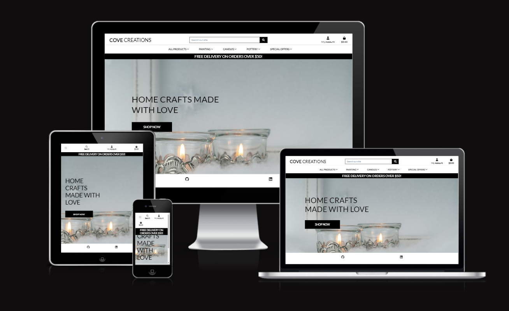

<h1 align="center">Cove Creations</h1>

[View the live project here.](https://covecreations-db940de5c766.herokuapp.com/)

Cove Creations is an idea I formed with the help of a close family member who has a passion for home crafts and painting.
The goal is to create a platform to display various items and paintings for sale, and to provide a robust, easy to use, 
lovely to look at, and welcoming site for those interested in crafts




## Business Plan:

## Summary:

- Cove Creations goal is to mainly cater to the crafts and gifts market. More so these days than ever people
are appreciating unique, custom, and handmade products more than ever, rather mass produced cookie cutter products.

- The ultimate goal is to provide a welcoming easy to use website, that users can browse at their leasure, 
find a product that interests them, make a purchase, register for an account, view their profile, update their details,
and so on.

### 

- The origin of this idea came from mutual conversation with an artistic family member, they have a passion for
art, crafts, pottery, creating, and are very talented in making their items feel like a huge amount of care is 
taken in each individual order

- The target market for is, in a wide array, the gifts market, and in scope, for indivduals looking for unique
and interesting products either for themselves or for a loved one.

## Products and services

- Our products range from unique, non repeatable paintings, candles of all variety (Scented, Melts, & Non-Scented)
and pottery such as mugs, plates and vases

- Our unique selling point is simply the love and quality gon in to each product, great levels of care and effort go into
each item, and it shows. Often it's to just get someone a voucher, socks or some bodywash, but with our items your loved one
is sure to appreciate the level of thought gone into each product

### Organization and Management

- The business will be divided very simply, I will work on the technical side, website creation, marketing
and treding research, and my sister will focus solely on the creative side, making the products, creating
new ideas, and fufilling orders

### User Stories

 - #### First Time Visitor Goals

        - As a First Time Visitor, I want to easily understand the main purpose of the site.

        - As a First Time Visitor, I want to be able to easily navigate throughout the site to find products.

        - As a First Time Visitor, I want to be able to create an account.

- #### Returning Visitor Goals

        - As a Returning Visitor, I want to be able to log in/out.

        - As a Returning Visitor, I want to be able to see products.

        - As a Returning Visitor, I want to  be able to view products reviews to help with my purchase


- #### Frequent User Goals

        - As a Frequent User, I want to be kept up to date with a newsletter.

        - As a Frequent User, I want to updaye my profile details as they change
        
        - As a Frequent User, I want to be able to keep a basket with saved items.

### Design
-   #### Colour Scheme

        -   The two main colours used are black and white, with accented images and text design. The site contains many product
        images to color and design was kept simple to steer the users attention to the products. I feel if I introduce distinct
        or visually distracting colours it will take the users attention from the products

-   #### Imagery
        -  The home page contains a simple background image, and each products has its own image so a user can see 
        the products in question. I decided to go for a simple layout to keep the focus on the products, as they
        are quite pleasing in their own right. I hope to encourage user to explore the site and see everything
        there is on offer

### Wireframes
<details>
<summary>Click here to view</summary>
<br>


</details>

- - -

<details>
<summary>Click here to view Facebook mockup</summary>
<br>


</details>

## Technologies Used

### Languages Used

-   [HTML5](https://en.wikipedia.org/wiki/HTML5)

-   [CSS3](https://en.wikipedia.org/wiki/Cascading_Style_Sheets)

-   [JavaScript](https://en.wikipedia.org/wiki/JavaScript)

-   [Python](https://en.wikipedia.org/wiki/Python_(programming_language))

### Frameworks, Libraries & Programs Used

1. [Bootstrap 4.4.1:](https://getbootstrap.com/docs/4.4/getting-started/introduction/)
    - Bootstrap was used to assist with the basic layout.

2. [GitHub:](https://github.com/)
    - GitHub is used to store the projects code after being pushed from Git.

3. [Balsamiq:](https://balsamiq.com/)
    - Balsamiq was used to create the wireframes during the design process.

4. [Django](https://www.djangoproject.com/)

5. [Font Awesome:](https://fontawesome.com/)
    - Font Awesome was used on all pages throughout the website to add icons

### Agile Methodology

I have strived to use agile methodolgy throughout this project as planning in advance has made the over all project easier to
manage, I have learned the importance of breaking the project into smaller individual tasks, the use of a kanban board
has also been a great asset as it makes visualizing the tasks at hand much easier

The project board was divided into 3 sections:

  -  To-Do

  -  In Progress

  -  Done-

<details>
<summary>Click here to view</summary>
<br>


</details>


## Performance

### Google's Lighthouse Performance

[Google Lighthouse](https://developers.google.com/web/tools/lighthouse) was used to test the performance of the website.

<details>
<summary>Desktop</summary>
<br>


</details>

<details>
<summary>Mobile</summary>
<br>


</details>

## Testing

The W3C Markup Validator and W3C CSS Validator Services were used to validate every page of the project to ensure there were no syntax errors in the project, there are however some errors in the bootstrap the do not effect the code or site.

-   [W3C Markup Validator](https://validator.w3.org/)

-   [W3C CSS Validator](https://jigsaw.w3.org/css-validator/#validate_by_input)

-   [Python Linter](https://pep8ci.herokuapp.com/)

<details>
<summary>HTML Validation</summary>
<br>


</details>

<details>
<summary>CSS Validation</summary>
<br>


</details>

<details>
<summary>Python Validation</summary>
<br>


</details>


### Testing User Stories from User Experience (UX) Section

#### First Time Visitor Goals

1. As a First Time Visitor, I want to easily understand the main purpose of the site and learn more about the site.

    - The home page includes a greeting with a banner, navigation bar, and logo. The layout is kept clean and simple
    so as to not over overwhelm a new visitor 

- - -

2. As a First Time Visitor, I want to be able to easily be able to view products and navigate the site

    - The catagories are kept clean and easily readable

    - There are prompts to help a user find what their looking for if they had a particular product in mind

- - -

3. As a First Time Visitor, I want to look for products and see price, a description, and ratings 

    - All information on each product is kept together so users can get all of the informaton they need on each product

    - Each products has a unique name, descriptions, rating and price

- - -

#### Returning Visitor Goals

1. As a Returning Visitor, I want to find new products, promotions, and sales

    - These are all organized neatly into the appropriate tabs and pages

2. As a Returning Visitor, I want to make an account

    - There is the option to create an account and is easily accessable

3. As a Returning Visitor, I want to be able subscribe to a newsletter

    - The footer contains an email subscription input so the user can easily subscribe

- - -

#### Frequent User Goals

1. As a Frequent User, I want to be able to log in or out of my account

    - The user can easily and clearly log in/out in the navigation bar

2. As a Frequent User, I want to add and remove items from my on site shopping basket

    - The shopping basket is dynamic, adds, removes, and shows total as the site user makes actions

3. As a Frequent User, I want to be able to view my order history and change my profile details

    - The users order history will be available on their profile as they make orders

    - There is a dedicated profile details page where a user can easily update their information

- - -

## Newsletter Testing

- I wanted to keep this as inintrusive as possible, users will me prompted with a pop-up
to subscibe to our newsletter after being on the site for 20 seconds, this is limited to happening 
once a day so as not to spam

<details>
<summary>Click here to view mobile prompt</summary>
<br>


</details>

<details>
<summary>Click here to view desktop prompt</summary>
<br>


</details>

<details>
<summary>Click here to view Mailchimp success prompt</summary>
<br>


</details>

### Further Testing

-   The Website was tested on Google Chrome, Microsoft Edge, Firefox & Safari

-   The website was viewed on a variety of devices such as Desktop, Mobile & Tablet

- - -

## Libraries
- dj-database-url - A Django utility to utilise the DATABASE_URL environment variable to configure the Django application. Used with PostgreSQL.

- Django - A python package for the Django framework.

- django-allauth - An integrated set of Django applications addressing user authentication, registration and account management.

- django-crispy-forms - A Django package that provides tags and filters to control the rendering behaviour of Django forms. 

- gunicorn - A Python WSGI HTTP Server for UNIX.

- oauthlib - A generic, spec-compliant, thorough implementation of the OAuth request-signing logic for Python 3.6+.

- psycopg2 - A PostgreSQL database adapter for Python.

- PyJWT - A Python library that allows for encoding and decoding of JSON Web Tokens (JWT).

- sqlparse - A non-validating SQL parser for Python.

## Deployment

### GitHub Pages

The project was deployed to GitHub Pages using the following steps...

1. Log in to GitHub and locate the [GitHub Repository](https://github.com/)

2. At the top of the Repository (not top of page), locate the "Settings" Button on the menu.
    - Alternatively Click [Here](https://raw.githubusercontent.com/) for a GIF demonstrating the process starting from Step 2.

3. Scroll down the Settings page until you locate the "GitHub Pages" Section.

4. Under "Source", click the dropdown called "None" and select "Master Branch".

5. The page will automatically refresh.

6. Scroll back down through the page to locate the now published site [link](https://github.com) in the "GitHub Pages" section.

- - -

### Making a Local Clone

1. Log in to GitHub and locate the [GitHub Repository](https://github.com/ShaneMurphyDev/Project-Portfolio-5)

2. Under the repository name, click "Clone or download".

3. To clone the repository using HTTPS, under "Clone with HTTPS", copy the link.

4. Open Git Bash

5. Change the current working directory to the location where you want the cloned directory to be made.

6. Type `git clone`, and then paste the URL you copied in Step 3.

```
$ git clone https://github.com/ShaneMurphyDev/Project-Portfolio-5
```

7. Press Enter. Your local clone will be created.

```
$ git clone https://github.com/ShaneMurphyDev/Project-Portfolio-5
> Cloning into `CI-Clone`...
> remote: Counting objects: 10, done.
> remote: Compressing objects: 100% (8/8), done.
> remove: Total 10 (delta 1), reused 10 (delta 1)
> Unpacking objects: 100% (10/10), done.
```
Click [Here](https://help.github.com/en/github/creating-cloning-and-archiving-repositories/cloning-a-repository#cloning-a-repository-to-github-desktop) to retrieve pictures for some of the buttons and more detailed explanations of the above process.


## Credits

### Code

-   Django User requests and interface/models tutorial [Here](https://docs.djangoproject.com/en/4.2/topics/class-based-views/generic-editing/#models-and-request-user)

-   [Bootstrap4](https://getbootstrap.com/docs/4.4/getting-started/introduction/)

- Stackoverflow community for all the posts, comments and help with any issues I ran into
during development

- Code institute for their walkthrough project Butique Ado which was used as core for my website

- W3schools for all help involving various syntax issues

- youtube channels from Denis Ivvy, Code artistan lab, Very accademy and Rathar Kuman which videos and django e-commerce projects I watched to get better understanding of the code

### Content

-   All content was written by the developer.

-   Color pallete from: [Cooler](https://coolors.co/)

### Media

-   All Images were taken from [Pixabay](https://pixabay.com/) or provided by my family member who made the crafts

### Acknowledgements

-   My Mentor for continuous helpful feedback.

-   Tutor support at Code Institute for their support.

- My sister for helping with the idea and providing me with images of the crafts she has made